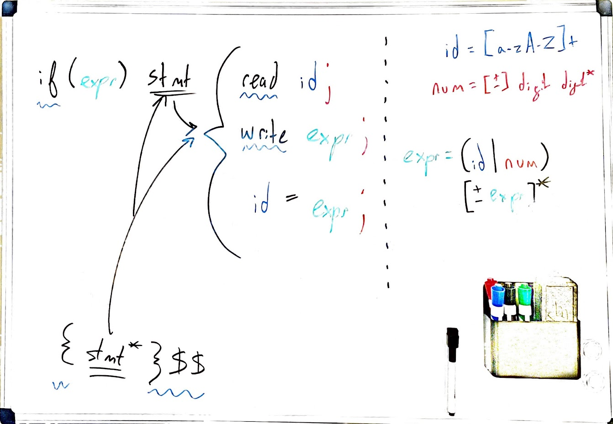

# Racket Parser

A simple Racket parser done as part of my course work for CS 441. It reads in source code, compares it to an internal grammar, and outputs either `Accept` or an error message.

One caveat is that the error messages are not as nice as I'd like. Ideally they would read something like `Syntax error on line 5`, but currently we're getting `Encountered unexpected token of type 'MISC (value "*") while parsing 'unknown [line=5, column=#f, offset=73]`. I probably need the [srcloc](https://docs.racket-lang.org/reference/exns.html#%28def._%28%28quote._~23~25kernel%29._srcloc-~3estring%29%29) function to get the output I want, but I haven't been able to get it working right.

## File Structure

- **main.rkt** - Main program. Contains the `parse()` function.

## Development Resources

## Grammar Breakdown

 

## Unit Tests

| File       | Oracle | Notes                                                                                                                                                                                                                                                   |
|------------|--------|---------------------------------------------------------------------------------------------------------------------------------------------------------------------------------------------------------------------------------------------------------|
| input1.txt | Pass   | A minimal program, but enough is there to be valid.                                                                                                                                                                                                     |
| input2.txt | Pass   | Not quite so minimal, but this should parse OK.  Note that your program only needs to do parsing, not semantic analysis; your need not worry about undeclared or uninitialized variables. You are concerned only with the mechanical form of the code.  |
| input3.txt | Fail   | This has an error. The "then" will be interpreted as an identifier, and our grammar does not allow 2 identifiers in a row.                                                                                                                              |
| input4.txt | Pass   | Binary v. unary minus. This should parse, as adding -273 to a variable should be legal. (The + begins the etail, the - is a numsign.)  An additional operator would be illegal, of course.                                                              |
| input5.txt | Fail   | Syntax error, illegal character ('*') in arithmetic expressions.                                                                                                                                                                                        |
